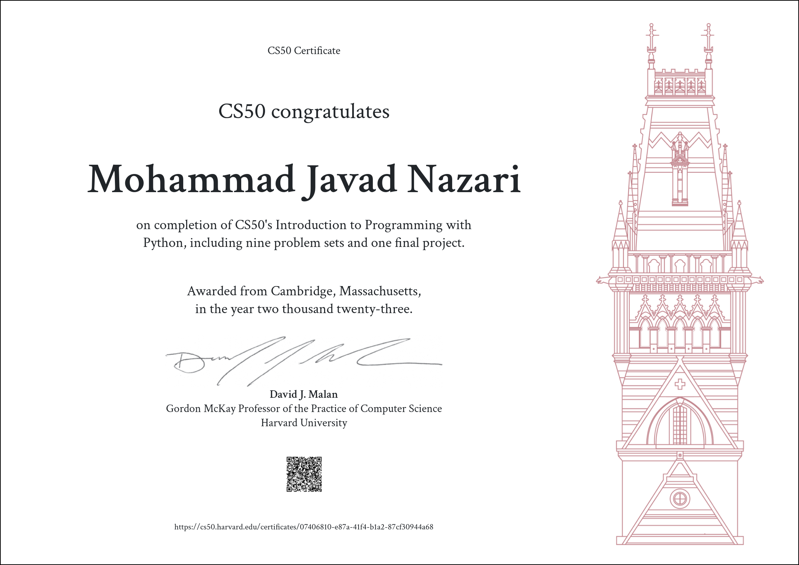

# CS50P 2023 --> Programming with Python  

### These are my solutions for CS50P Introduction to Programming with Python 2023.
### Final Project : [The Ultimate Game Collection: A Trio of Classics](#)
 
:warning: Warning & Disclaimer:
The following codes are for educational purposes only and are not intended to be used/submitted as your own solutions.

:no_entry_sign: Cheating Violates:
The [Academic Honesty](https://cs50.harvard.edu/python/2023/honesty/) of the course, not to mention it's totally pointless if you actually want to learn programming.

:email: Concerns:
I like to share my progress, which also helps motivate me to finish the course faster. However, if any directors of the course want me to take this down, I will gladly do so. Just shoot me a message via <mohammad.nazari@live.com>.
 

## Table of Contents
### [Week 0](/Week%0/) - [Functions, Variables](https://cs50.harvard.edu/python/2023/weeks/0/)
- [Indoor Voice](/Week%0/Indoor/)
- [Playback Speed](/Week%0/Playback/)
- [Making Faces](/Week%0/Faces/)
- [Einstein](/Week%0/Einstein/)
- [Tip Calculator](/Week%0/Tip/)

### [Week 1](/Week%1/) - [Conditionals](https://cs50.harvard.edu/python/2023/weeks/1/)
- [Deep Thought](/Week%1/Deep/)
- [Home Federal Savings Bank](/Week%1/Bank/)
- [File Extensions](/Week%1/Extensions/)
- [Math Interpreter](/Week%1/Interpreter/)
- [Meal Time](/Week%1/Meal/)

### [Week 2](/Week%2/) - [Loops](https://cs50.harvard.edu/python/2023/weeks/2/)
- [camelCase](/Week%2/Camel/)
- [Coke Machine](/Week%2/Coke/)
- [Just setting up my twttr](/Week%2/Twttr/)
- [Vanity Plates](/Week%2/Plates/)
- [Nutrition Facts](/Week%2/Nutrition/)

### [Week 3](/Week%3/) - [Exceptions](https://cs50.harvard.edu/python/2023/weeks/3/)
- [Fuel Gauge](/Week%3/Fuel/)
- [Felipe's Taqueria](/Week%3/Taqueria/)
- [Grocery List](/Week%3/Grocery/)
- [Outdated](/Week%3/Outdated/)

### [Week 4](/Week%4/) - [Libraries](https://cs50.harvard.edu/python/2023/weeks/4/)
- [Emojize](/Week%4/Emojize/)
- [Frank, Ian and Glen's Letters](/Week%4/Figlet/)
- [Adieu, Adieu](/Week%4/Adieu/)
- [Guessing Game](/Week%4/Game/)
- [Little Professor](/Week%4/Professor/)
- [Bitcoin Price Index](/Week%4/Bitcoin/)

### [Week 5](/Week%5/) - [Unit Tests](https://cs50.harvard.edu/python/2023/weeks/5/)
- [Testing my twttr](/Week%5/Test_twttr/)
- [Back to the Bank](/Week%5/Test_bank/)
- [Re-requesting a Vanity Plate](/Week%5/Test_plates/)
- [Refueling](/Week%5/Test_fuel/)

### [Week 6](/Week%6/) - [File I/O](https://cs50.harvard.edu/python/2023/weeks/6/)
- [Lines of Code](/Week%6/Lines/)
- [Pizza Py](/Week%6/Pizza/)
- [Scourgify](/Week%6/Scourgify/)
- [CS50 P-Shirt](/Week%6/Shirt/)

### [Week 7](/Week%7/) - [Regular Expressions](https://cs50.harvard.edu/python/2023/weeks/7/)
- [NUMB3RS](/Week%7/Numb3rs/)
- [Watch on YouTube](/Week%7/Watch/)
- [Working 9 to 5](/Week%7/Working/)
- [Regular, um, Expressions](/Week%7/Um/)
- [Response Validation](/Week%7/Response/)

### [Week 8](/Week%8/) - [Object-Oriented Programming](https://cs50.harvard.edu/python/2023/weeks/8)
- [Seasons of Love](/Week%8/Seasons/)
- [Cookie Jar](/Week%8/Jar/)
- [CS50 Shirtificate](/Week%8/Shirtificate/)
